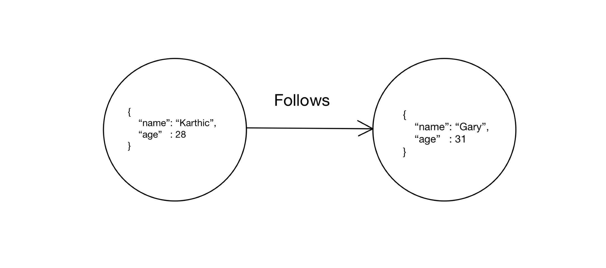
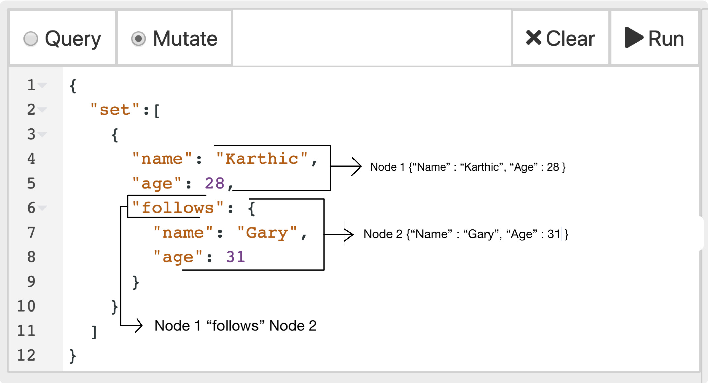
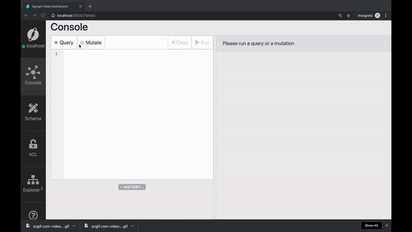
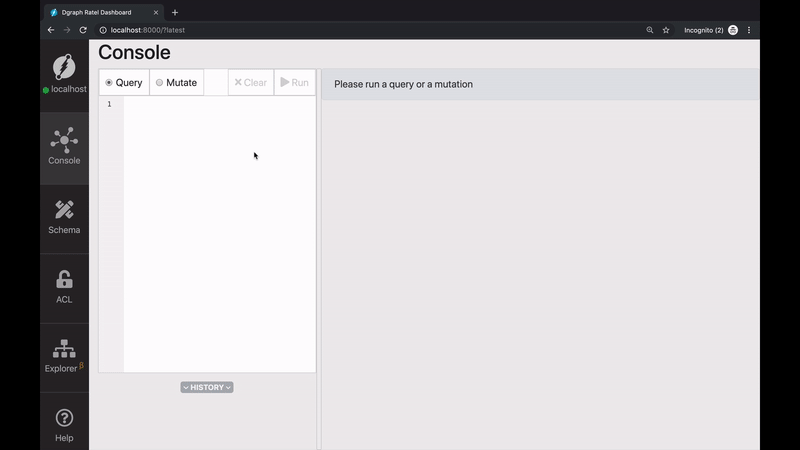
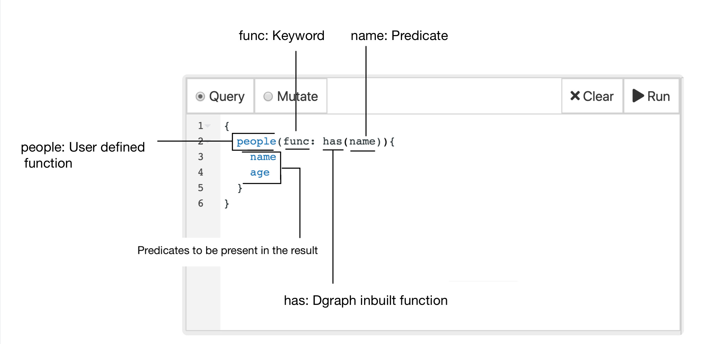

### Getting started with Dgraph

Welcome to getting started with Dgraph.
I'm Karthic Rao, a Developer Advocate at Dgraph labs.
Dgraph is an open-source, transactional, distributed, native graph database.
Here is the first one of the tutorial series on using Dgraph.


In this tutorial, we'll learn how to build the following graph on Dgraph,



In the process, we'll learn about,

- Running Dgraph using Docker compose.
- Running the following basic operations using Dgraph's UI Ratel,
  - Creating a node.
  - Creating an edge between two nodes.
  - Querying for the nodes.

---

## Running Dgraph

<!-- TODO(karthic): replace this with dgraph-standalone once it's ready -->

Docker-compose is the quickest way to get started with Dgraph.
Ensure that Docker and docker-compose are installed on your machine.
You can find the docker-compose configuration in the documentation site at https://docs.dgraph.io.
Specifically, in the `Getting Started` section which you can access directly
[here](https://docs.dgraph.io/get-started/#docker-compose).

Copy the configuration file, paste it in a file by name `docker-compose.yml`.
 Now, it's just a matter of running `docker-compose up`, and you have Dgraph up and running.

---

### Nodes and Edges
In this section, we'll build a simple graph with two nodes and an edge connecting them.


In a Graph database, concepts or entities are represented as nodes.
May it be a sale, a transaction, a place, or a person, all these entities are
represented as nodes in a Graph database.

An edge represents the relationship between two nodes.
The two nodes in the above graph represent people: `Karthic` and `Gary`.
You can also see that these nodes have two associated properties: `name` and `age`.
These properties of the nodes are called `predicates` in Dgraph.

Karthic and Gary are friends. The `friend` edge between them represents their relationship.
The edge connecting two nodes is also called a `predicate` in Dgraph,
although this one points to another node rather than a string or an integer.

The docker-compose setup comes with a useful Dgraph UI called Ratel.
Just visit `http://localhost:8000` from your browser, and you will be able to access it.


We'll be using the latest stable release of Ratel.


---

### Mutations using Ratel

The create, update, and delete operations in Dgraph are called mutations.

Ratel makes it easier to run queries and mutations.
We'll be exploring more of its features all along with the tutorial series.

Let's go to the Mutate tab and paste the following mutation into the text area.
_Do not execut it just yet!_

```json
{
  "set": [
    {
      "name": "Karthic",
      "age": 28
    },
    {
      "name": "Gary",
      "age": 31

    }
  ]
}
```

The query above creates two nodes, one corresponding to each of the JSON value associated with `"set"`.
However, it doesn't create an edge between these nodes.

A small modification to the mutation will fix it so it creates an edge in between them.

```json
{
  "set":[
    {
      "name": "Karthic",
      "age": 28,
      "follows": {
        "name": "Gary",
        "age": 31
      }
    }
  ]
}
```



Let's execute this mutation. Click Run and boom!



You can see in the response that two UIDs (Universal IDentifiers) have been created.
The two values in the `"uids"` field of the response correspond
to the two nodes created for "Karthic" and "Gary".

---

### Querying using the `has` function

Now, let us run a query to visualize the nodes which we just created.
We'll be using Dgraph's `has` function.
The function `has(name)` returns all the nodes with a predicate `name` associated with them.

```sh
{
  people(func: has(name)) {
    name
    age
  }
}
```

Go to the `Query` this time tab and type in the query above.
Then, click `Run` on the top right of the screen.



Ratel renders a graph visualization of the result.

Just click on any of them, notice that the nodes are assigned UIDs,
matching the ones we saw in the mutation's response.

You can also view the JSON results in the JSON tab on the right.


---

### Understanding the query.



The first part of the query is the user-defined function name.
In our query, we have named it as `people`. However, you could use any other name.

The `func` parameter has to be associated to a builtin function of Dgraph.
Dgraph offers a variety of builtin functions. The `has`  function is one of them.
Check out the [query language guide](https://docs.dgraph.io/query-language) to know more about other builtin functions in Dgraph.

The inner fields of the query are similar to select statement in SQL, or to a GraphQL query!

You can easily specify which predicates you want to get back.

```
{
  people(func: has(name)) {
    name
  }
}
```

Similarly, you can use the `has` function to find all nodes with the `age` predicate.

```sh
{
  people(func: has(age)) {
    name
  }
}
```

---

### More on mutations

We can extrapolate the mutation syntax to create more nodes and edges.


```json
{
  "set":[
    {
      "name": "Michael",
      "age": 40,
      "follows": {
        "name": "Pawan",
        "age": 28,
        "follows":{
          "name": "Natalya",
          "age": 30
        }
      }
    }
  ]
}
```

---

### Flexible schema

Dgraph doesn't enforce a structure or a schema, instead you can start entering
your data immediately and add constraints as needed.

Let's look at this query.

```json
{
  "set":[
    {
      "name": "Balaji",
      "age": 23,
      "country" : "India"
    },
    {
      "name": "Daniel",
      "age": 25,
      "city": "San Diego"
    }
  ]
}
```

We are creating two nodes, while the first node has predicates `name`, `age`, and `country`,
the second one has `name`, `age`, and `city`.

Schemas are not needed initially, instead Dgraph will create new
predicates as they appear in your mutations.
This flexibility can be very useful, but if you prefer to force your
mutations to follow a given schema there are options available that
we will explore in an upcoming episode.

---

### Wrapping up

In this video we learned the basics of Dgraph, including how to
run the database, add new nodes and predicates, and query them
back.

Before we wrap here's some quick bits about the next video.
Did you know that the nodes can also be fetch given their UID?
They also can be used to create an edge between existing nodes!

Sounds interesting?

See you all soon in the next tutorial, till then, happy Graphing!
