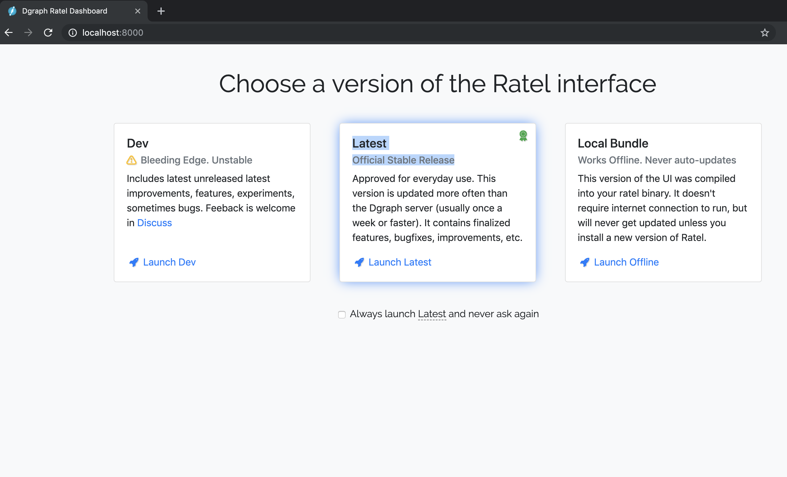
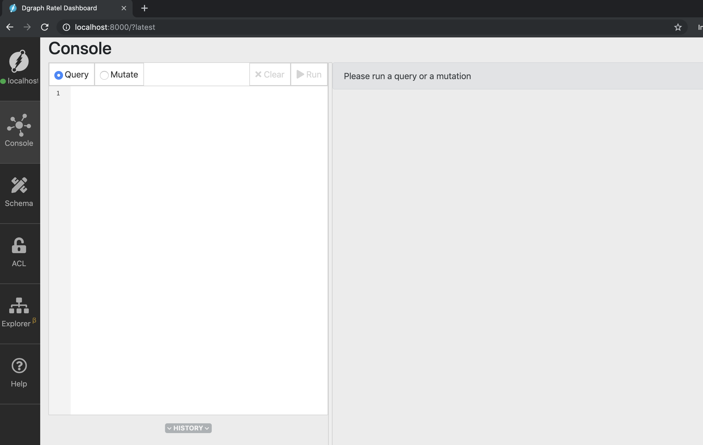
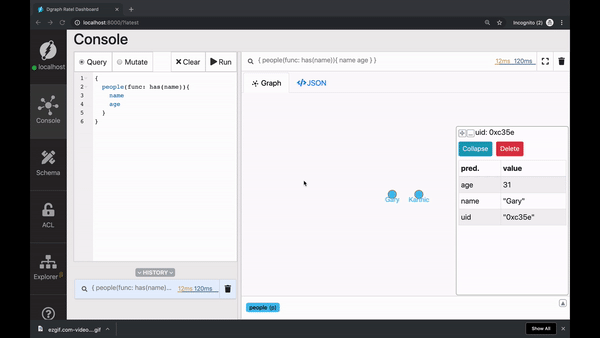

### Getting started with Dgraph

Welcome to getting started with Dgraph. I'm Karthic Rao,  Developer Advocate at Dgraph labs. 
Here is the first of the tutorial series on 
In this tutorial, we'll learn to build a simple graph on Dgraph, 


In the process we'll learn about, 

- Running Dgraph using Docker compose. 
- Run the following basic operations using Dgraph's UI Ratel, 
  - Create node
  - Create an edge between the nodes.
  - Query for the nodes.
   
---

## Running Dgraph
Docker-compose is the quickest way to get started with Dgraph. Ensure that 
Docker and docker-compose installed on your machine. You can find the docker-compose 
configuration in the documentation site at docs.dgraph.io. 
Go to the `Getting Started` section on the left, scroll down and you can to 
find the Docker compose configuration. 

Alternatively, you could also find the docker-compose configuration from 
[this link](https://github.com/dgraph-io/dgraph/blob/master/wiki/content/get-started/index.md#docker-compose)  below.

Copy the configuration, paste it in a file by name `docker-compose.yml`.
 Now, it's just a matter of running `docker-compose up`, and you have 
 Dgraph up and running. 

---

### Nodes and Edges
In this exercise, let's build a simple graph with two-node and an edge connecting them.


In a Graph database, any real-world objects or entities are represented as nodes.
May it is a sale, a transaction, a place or a person, all these entities are 
represented as a node in a Graph database.

An edge represents the relationship between the nodes. The two nodes in the above graph represent 
people, `Karthic` and `Gary`. You could also see that these nodes have two 
associated properties, `name` and `age`. These properties of the nodes are 
also called as `predicates` in Dgraph. 

Karthic and Gary are friends. The `friend` edge between them represents their 
relationship.  The edge connecting two nodes are also called as `uid predicates` in Dgraph. 

Like I mentioned earlier, we'll be using Ratel, Dgraph UI, for performing the 
necessary operations. The docker-compose setup should already have Ratel up and 
running. Just visit `http://localhost:8000` from your browser, and you should be able to access Ratel. 




We'll be using the latest stable release of Ratel. 



---

### Mutations using Ratel
The Create, Update and Delete operations in Dgraph are called as mutations. 

Using Ratel, you could run queries and obtain their graph visualizations, 
perform mutations, update the schema and much more. 

Let's go the Mutate tab and create the nodes using the set operation. Let's 
write the mutation first, but wait! It's not complete yet! 


```json
{
  "set": [
    {
      "name": "Karthic",
      "age": 28
    },
    {
      "name": "Gary",
      "age": 31

    }
  ]
}
```

The set function takes an array of JSON values and creates a node for each of them. 
The query above creates two nodes, one corresponding to each of the JSON value. 
However, it doesn't create an edge between these nodes. 

A small modification to the query above would create an edge between these two nodes.   

```json
{
  "set":[
    {
      "name": "Karthic",
      "age": 28,
      "follows": {
        "name": "Gary",
        "age": 31
      }
    }
  ]
}
```


Let's execute this mutation. Click Run and boom! 


---

### Querying using has function

Now, let us run a query to obtain the nodes which we just created. 
We'll be using Dgraph's `has` function in our query. 
In short, `has(my_predicate)` returns one or more nodes with `my_predicate` in it. 
We know that both nodes created have predicate name and age in them.

```sh
{
  people(func: has(name)) {
    name 
    age
  }
}
```

Go to the `Query` tab and type in the query.
Click `Run` on the top right of the screen. 


Two nodes appear in the result. On clicking the nodes, you could observe that 
the nodes are assigned uid's. You could even use these uid's to query for nodes. 
We'll be doing that in the next video. 


Alternatively, you could also view the JSON results from the JSON tab on the right. 




---

### Deciphering the query.


 
The first part of the query is the user-defined function name. In this case, 
we have named it as `people`. However, one could use any name.  

`func` keyword has to be assigned to an inbuilt function. Dgraph offers a variety 
of inbuilt functions. The `has`  function is one of them.  Check out the 
[query language guide](https://docs.dgraph.io/query-language) to know more about 
other in-built functions in Dgraph. Even better, just subcribe to the channel and follow along :)

The inner fields are similar to select statement in SQL. `Has` selects the nodes, 
the inner field defines the list of predicates to be present for each node in the included in the result. 

Similarly, we could use the `has` function to find all nodes with the `age` 
predicate. You could also alter the inner fields. 

```sh
{
  people(func: has(age)) {
    name
  }
}
```

---

### More on mutations
We can extrapolate the mutation syntax to create more nodes and edges. 


```json
{
  "set":[
    {
      "name": "Michael",
      "age": 40,
      "follows": {
        "name": "Pawan",
        "age": 28,
        "follows":{
          "name": "Natalya",
          "age": 30
        }
      }
    }
  ]
}
```

---

### Flexible schema 
Dgraph implicitly doesn't enforce a structure or a schema to the JSON 
properties/predicates of a node. It's flexible. 
Here is one such example, 

```json
{
  "set":[
    {
      "name": "Balaji",
      "age": 23,
      "country" : "India"
    },
    {
      "name": "Daniel",
      "age": 25,
      "city": "San Diego"
    }
  ]
}
```

We are creating two nodes, but the first node has predicates `name, age and country`
The second one has `name, age and city`. 

The schema flexibility allows one to dynamically add predicates. 

Dgraph internally stores data as predicates associated with an `uid`.
It doesn't have a notion of nodes. 
But for convinience and ease of of modelling, we could use a node as an abstraction. 

---

### Wrapping up
That's it for this video.
I hope this video made it easy for you get started with Dgraph. 

Before we wrap here's some quick bitsDo you know that the `uid's` can be used to query, update and delete predicates? 
It could also be used to create an edge between existing nodes? 

Sounds interesting? 

See you all soon, till then, happy Graphing! 

---

