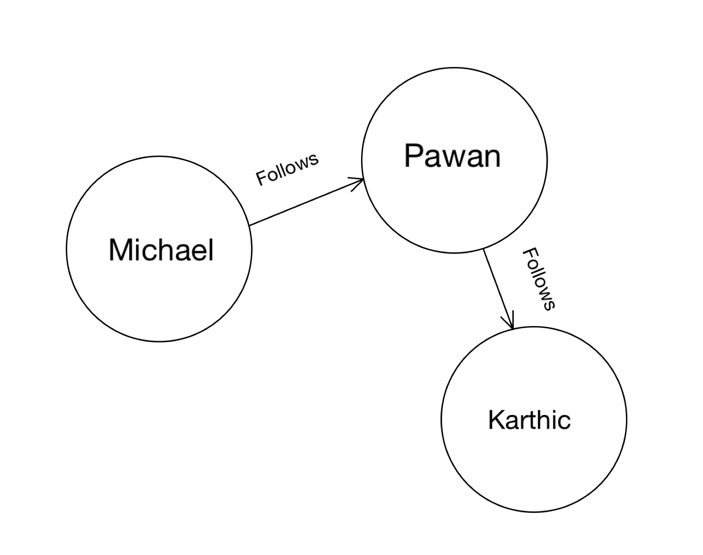
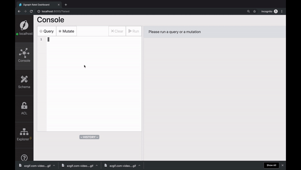
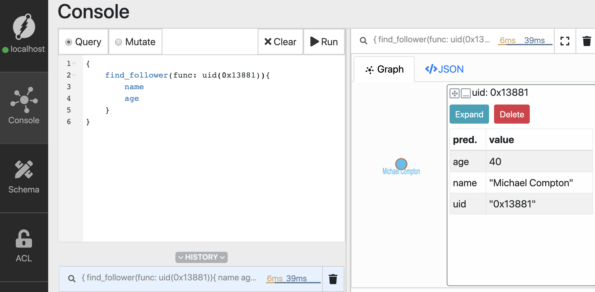
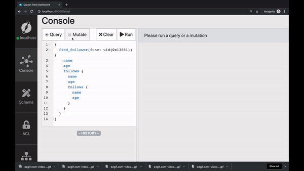
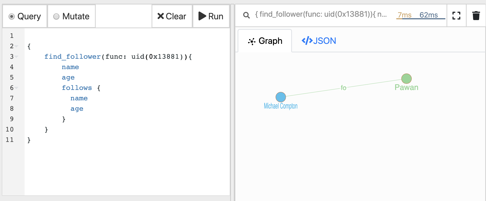
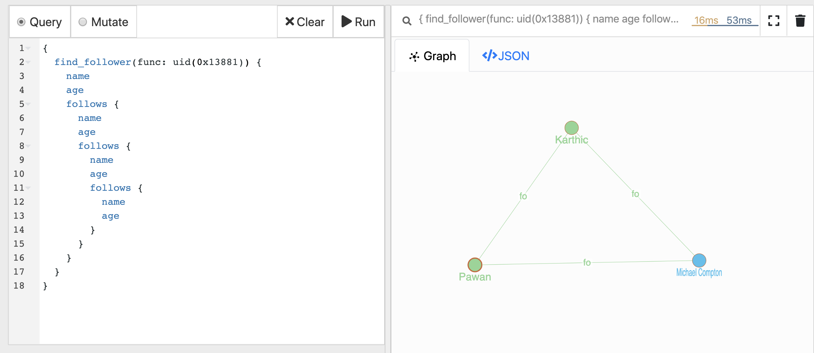
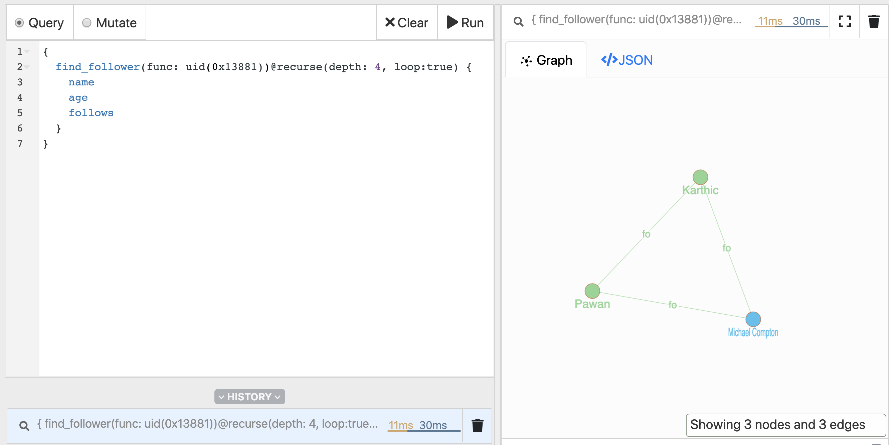
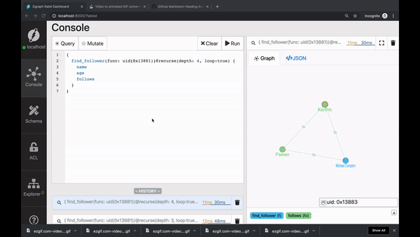

# UID's, updates, traversals and deletes 
Hi, welcome to the second episode of getting started with Dgraph. 
In the last video, we learned some of the basics of Dgraph. 
Including, how to run the database, add new nodes and predicates, and query them back.

<Karthic will be replaced by Mary in the Graph below, it's just a reference for now>


In this tutorial, we'll build the above Graph and learn more about operations using the uid of the nodes.
Specifically, we'll learn about:
- Querying, updating, and deleting nodes using their uids.
- Adding an edge between existing nodes.
- Traversing the Graph.

First, let's create our Graph.

Go to Ratel's mutate tab, paste the mutation below in the text area, click run.


```json
{
  "set":[
    {
      "name": "Michael",
      "age": 40,
      "follows": {
        "name": "Pawan",
        "age": 28,
        "follows":{
          "name": "Mary",
          "age": 28
        }
      }
    }
  ]
}
```


<Will replace the Gif below with a screenshot> 



## Query using uids
The `uid` of the nodes can be used to query them back. 
The built-in function `uid()` takes either an `uid` of a node or a list of `uids` as an input argument.
And, it returns nodes with the matching uids on execution.

Let's see it in action. 
First, let's copy the uid of the node created for `Michael.` 

Go to the query tab, type in the query, and click run.
```sh
{
  people(func: has(name)) {
    name
    age
  }
}
```

Now, from the result, copy the `uid` of Michael's node. 

In the query below, replace the uid `0x1388`, with the `uid` you just copied.
Dgraph generates these uid's based on some complex logic.
Hence, we might have a small chance of having the same uid's.

Let's run the query, 

```sh
{
    find_using_uid(func: uid(0x13881)){
        name 
        age
    }
}
```


You can see that the `uid()` function returns the node matching the uid `0x13881`.

Refer to the last episode if you have questions related to the structure of the query in general.

## Updating predicates
You can also update one or more predicates of a node using its `uid.` 

Michael recently celebrated his 41st birthday. Let's update his age to 41. 

Let's go to the mutate tab and execute the mutation. 
Again, don't forget to replace the `uid` with the one you just copied. 


```json
{
  "set":[
    {
      "uid": "0x13881",
      "age": "41"
    }
  ]
}
```

We had earlier used `set` to create new nodes. 
Although, on using the `uid` of an existing node, it updates its predicates, instead of creating a new node.

You can see that Michael's age is updated to 41.

```sh
{
    find_using_uid(func: uid(0x13881)){
        name 
        age
    }
}
```



Similarly, you can also add new predicates to an existing node.
Since the predicate `country` doesn't exist for the node with the uid `0x13881`, it creates a new one.

```json
{
  "set":[
    {
      "uid": "0x13881",
      "country": "Australia"
    }
  ]
}
```

## Adding an edge between existing nodes
You can also add an edge between existing nodes using their uid's.

Let's say, `Mary` starts to follow `Michael.`

We know that this relationship between them has to represented by creating the `follows` edge between them.

<Add the illustration of the new Graph>

First, let's copy the `uids` of nodes for `Mary` and `Michael` from Ratel.

Now, replace the uid's with the ones you copied, and execute the mutation.

<An illustration will explain which Michael uid and which one is Mary's in the mutation below>


```sh
{
  "set":[
    {
      "uid": "0x13883",
      "follows": {
        "uid": "0x13881"
      }
    }
  ]
}

```


 
## Traversing the edges
Graph databases offer many distinct capabilities. 
`Traversals` are among them.
Traversal queries start their operation from a set of root nodes. 
These root nodes are selected using Dgraph's built-in functions.
Then, they follow the edges from these root nodes and return the nodes at the other end of the edges.

Traversals answer questions or queries related to the relationship between the nodes.
Hence, queries like, `Who does Michael follow?`
are answered by traversing the `follows` relationship.

```sh
{
    find_follower(func: uid(0x13881)){
        name 
        age
        follows {
          name 
          age 
        }
    }
}
```

<Add an illustration to explain the query>
Here's the result. 


The query has three parts:

1. **Selecting the root nodes.**

First, one or more nodes have to be selected as the starting point for traversals. 
These are called the root nodes.

In the query above, we use the `uid()` function to select the node created for `Michael` as the root node.

2. **Choose the edge to be traversed**
You need to choose the edge to be traversed from the selected root nodes.

In our query, we chose to traverse the `follows` edge starting from the selected root nodes.
The traversal returns all the nodes connected to the node for `Michael` via the `follows` edge.

3. **Specify the predicates to get back**
Since `Michael` only follows person, hence, the traversal returns just one node.
These are `level 1` nodes. 
Again, we need to specify which predicates you want to get back from level 1 nodes.

You can extend the query to make use of `level-1` nodes and traverse the Graph further.
Let's explore that in the next section.

#### Multi-level traversals 
The first level of traversal returns people, followed by Michael. 
The next level of traversal further returns the people they in-turn follow. 

This pattern can be repeated multiple times to achieve multi-level deep traversals. 
That's when we say that the query is deep! 

<funny illustration with Diggy saying that's so deep>


```sh
{
  find_follower(func: uid(0x13881)) {
    name 
    age 
    follows {
      name
      age
      follows {
        name 
        age
      }
    }
  }
}
```


```sh
{
  find_follower(func: uid(0x13881)) {
    name 
    age 
    follows {
      name
      age
      follows {
        name 
        age
        follows {
          name 
          age
        }
      }
    }
  }
}
```



This query is really long!
If you ask, isn't there are an in-built function that makes multi-level deep queries or traversals easy?

The answer is Yes!
That's what the `recurse()` function does.
Let's explore that in our next section.

#### Recursive traversals
Recurse queries makes it easier to perform multi-level deep traversals.
They let you easily traverse a subset of the Graph.

With the following recursive query, we achieve the same result as our last query.
But, with a much better querying experience. 

```sh
{
  find_follower(func: uid(0x13881))@recurse(depth: 4, loop:true) {
    name 
    age
    follows
  }
}
```



[Check out the docs](https://docs.dgraph.io/query-language/#recurse-query) for detailed instructions on using the `recurse` directive.

## Deleting a node

Ratel also makes it easier to compose mutation to delete a node.

Just click on the node and then click the delete button. 
In the text area, you should now see a mutation to delete the node.

Let's run it.




## Wrapping up
In this tutorial, we learned about the CRUD operations using UID's. 
We also learned about `recurse()` function. 

Before we wrap, here's a sneak peek into our next tutorial. 

Did you know that you could search predicates based on their value? 

Sounds interesting? 

See you all soon in the next tutorial, till then, happy Graphing!


