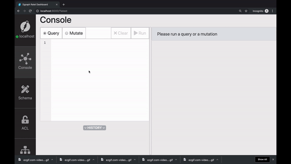
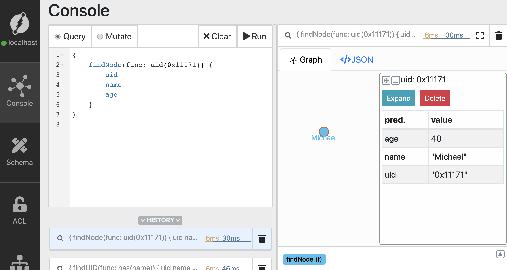

### Taking forward the momemtum
In the last [lesson](../1/README.md), we learnt ahout running Dgraph using dockerc-compose, mutations and couple of simple queries. 

Let's take forward the momemtum, and in this tutorial, let us learn about more queries, udpate and delete mutation. In this tutorial, we'll learn about, 

- Using uid's to run queries. 
- Update the nodes. 
- Delete the nodes. 
- Traversing the edge. 

## Using the node ID's for querying
In the last tutorial, we saw that Dgraph assigns an unique identifier `uid`, to all the newly created nodes. 

Let's take a closer look at these uid's and use them to run queries. 

You could use the same [docker compose](../1/docker-compose.yml) file from the last tutorial. 


#### Running Dgraph 
Let's quickly get Dgraph up and running and insert some sample data. 


```sh
$ wget https://raw.githubusercontent.com/hackintoshrao/dgraph-tutorials/master/getting-started/1/docker-compose.yml

$ docker-compose up
```

Just for simplying the setup for the tutorial, let's start afresh. Will be deleting all the data from the instance using Ratel. 

Go to Schema -> bulk edit - >Drop ALL 


---

#### Add sample data 
Let's go to Ratel, and run mutation to add the sample data. 

The mutation creates the following graph, 

```sh
{
  "set":[
    {
      "name": "Michael",
      "age": 40,
      "follows": {
        "name": "Pawan",
        "age": 28,
        "follows":{
          "name": "Karthic",
          "age": 28
        }
      }
    }
  ]
}
```
 


Let us query for the nodes and obtain their uid's, 

```sh
{
    findUID(func: has(name)) {
        uid 
        name 
        age 
    }
}

```


We could mention for `uid` in the list of fields to be included in the result. Ratel too can be used to find the UID of the nodes. 



Let's copy of the UID of node with `name` predicate set to `Michael`. 

So far, we've used Dgraph's `has` function in the queries. When using `uids` in queries we should be using the `uid` function. 

In the query below, Replace the uid `0x11171` with the `uid` you just copied. Let us run the query, 

```sh
{
    find_using_uid(func: uid(0x11171)){
        name 
        age
    }
}
```




---

#### Updating the node

Using the UID's we could even update and delete the node.

Let's update `name` property/predicate of the node. We'll be using the same `uid` from the last query. 


---

#### Deleting the node


---

#### Traversing the edges


---


