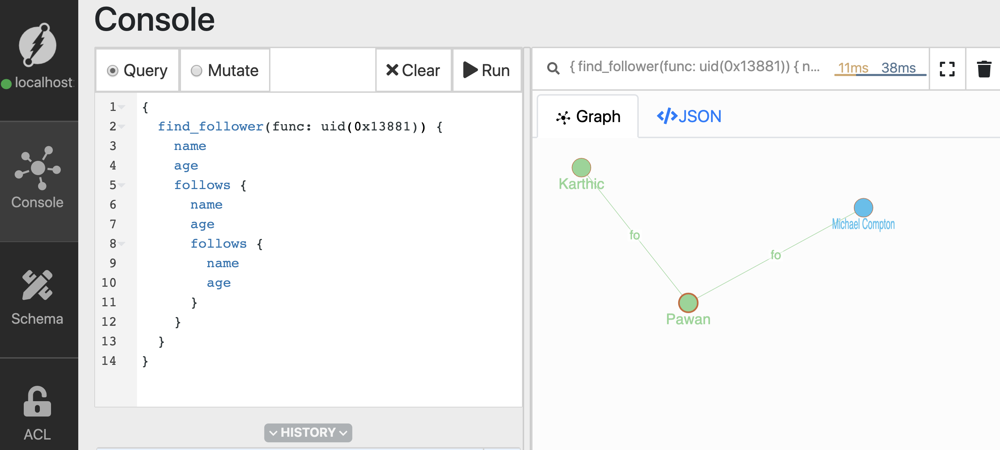

# UID's, updates, traversals and deletes 

Welcome to the second tutorial. 
I'm Karthic Rao, a Developer Advocate at Dgraph labs. 
Welcome to the second episode of the tutorial series on Dgraph. 
In the last video, we learned the basics of Dgraph. 
Including, how to run the database, add new nodes and predicates, and query them back.


In this tutorial, using the graph above, we'll learn about:
- [Querying using uids.](#query-using-uids)
- [Updating predicates.](#updating-predicates) 
- [Adding an edge between existing nodes.](#adding-an-edge-between-existing-nodes)
- [Traversing the edges.](#traversing-the-edges) 
  - [One level traversals](#one-level-traversals) 
  - [Two level traversals](#two-level-traversals)
  - [Recursive traversals](#recursive-traversals)
- [Deleting a node.](#deleting-a-node)

Refer to the last video for instructions on how to run Dgraph.

Let's first build the graph.

Go to Ratel's mutate tab, paste the mutation below in the text area, click run.

```json
{
  "set":[
    {
      "name": "Michael",
      "age": 40,
      "follows": {
        "name": "Pawan",
        "age": 28,
        "follows":{
          "name": "Mary",
          "age": 28
        }
      }
    }
  ]
}
```
 


## Query using uids

The built-in function `uid()`, takes in either an `uid` or list of `uids` as an argument.
And, it returns nodes with the matching uids on execution.

Let's see it in action. 
First, let's copy the uid of node created for `Michael`. 

Go to the query tab, type in the query, and click run.
```sh
{
  people(func: has(name)) {
    name
    age
  }
}
```

Now, from the result, copy the `uid` of Michael's node. 
We'll be using this uid in our next query.

In the query below, replace the uid `0x1388`, with the `uid` you just copied. 

Let's run the query, 

```sh
{
    find_using_uid(func: uid(0x13881)){
        name 
        age
    }
}
```


You can see that, the `uid()` function returns the node matching the uid `0x13881`.

## Updating predicates
You can also update one or more predicates of a node using its `uid`. 

Michael recently celebrated his birthday. Let's update Michael's age to 41. 

Here's the mutation to update the `age` predicate of node for `Michael`. Let's go to the mutate tab and execute. 
Don't forget to replace the `uid` with the one you copied. 

```json
{
  "set":[
    {
      "uid": "0x13881",
      "age": "41"
    }
  ]
}
```

We had earlier used `set` to create new nodes. 
Although, on using the `uid` of an already existing node, it updates its predicates, instead of creating a new node.

You can see that, Michael's age is now updated to 41.

```sh
{
    find_using_uid(func: uid(0x13881)){
        name 
        age
    }
}
```


Similarly, you can also add new predicates to the node.

```json
{
  "set":[
    {
      "uid": "0x13881",
      "country": "Australia"
    }
  ]
}
```

## Adding an edge between existing nodes

Similarly, you can add an edge between already existing nodes.

Consider the scenario where `Karthic` starts to follow `Michael`.
We could use the `uids` of both these nodes to create a `follows` edge between them. 
First, let's copy the `uids` from `Ratel.` 
The `uid` of `Karthic` is `0x13883`. 
We already have the uid of `Michael.` 

Let's execute the mutation, 

```sh
{
  "set":[
    {
      "uid": "0x13883",
      "follows": {
        "uid": "0x13881"
      }
    }
  ]
}

```


Now, with `Karthic` following `Michael,` the new Graph would look like this, 

<Add an image> 
 


## Traversing the edges

You can also traverse the edges connecting the nodes with queries.
Traversals take advantage of the relationship between the node. 
It helps uncover interesting facts about your data.

Let's revisit the graph we've built, <need to update the graph below>
. 
Traversals help you answer questions like, 
- Whom does Michael follow? 
- Whom does Pawan follow? 

What's more interesting is that the traversals can be extended to multiple levels. 

A two-level traversal could answer questions like, `Give me all the followers of people whom Michael follow.` 

Deeper traversals help unearth complex relationships and patterns in the data.


#### One level traversals 

Let's find how to find the people who `Michael` follow using one level traversal query. 

```sh
{
    find_follower(func: uid(0x13881)){
        name 
        age
        follows {
          name 
          age 
        }
    }
}
```

Here's the result. 


Let's dissect the query,
- The `uid()` function returns nodes with the matching uids.
  This returns the root nodes. 
- Using the name of edge  (`follows`) triggers graph   traversals from all the root level nodes. 
  This traverses and retuens all the nodes which are connected to the root level nodes via `follows` edge.
  These nodes are level 1 nodes. 


In our simple graph, Michael follows only one person. 
Hence the traversal only returns one node.


#### Two-level traversals 

You cam traverse further from level 1 nodes to level 2 nodes by extending the query. 
Let's try that next.

The first level of traversal returns people, followed by Michael. 
The next level of traversal further returns the people they follow. 


```sh
{
  find_follower(func: uid(0x13881)) {
    name 
    age 
    follows {
      name
      age
      follows {
        name 
        age
      }
    }
  }
}
```




#### Recursive traversals

Remember using the query for Level 2 traversal? Let's further expand it to traverse to another level, 


```sh
{
  find_follower(func: uid(0x13881)) {
    name 
    age 
    follows {
      name
      age
      follows {
        name 
        age
        follows {
          name 
          age
        }
      }
    }
  }
}
```


Though this works, it's not a great way to traverse the graph.
The queries become harder to compose as you traverse deeper.
The `Recurse()` directive is ideal for multiple level of traversals.

Recurse queries let you traverse a subset of the graph.
Either until we reach all leaf nodes or we reach the maximum depth which is specified by the depth parameter.

```sh
{
  find_follower(func: uid(0x13881))@recurse(depth: 4, loop:true) {
    name 
    age
    follows
  }
}
```


We achieve the same result, but with a much easier querying experience. 

[Check out the docs](https://docs.dgraph.io/query-language/#recurse-query) for detailed instructions on using the `recurse` directive.


## Deleting a node

Ratel makes it easier to compose `delete` mutations using the `uid's.` 

Just click on the node and click on the delete button. 
This auto-fills the mutation; let 's run it. 


## Wrapping up

In this tutorial, we learned the CRUD operations using UID's and `recurse()` function.  

Before we wrap, here's a sneak peek into our next tutorial. 

Did you know that you could do search predicates based on their value? 

Sounds interesting? 

See you all soon in the next tutorial, till then, happy Graphing!


