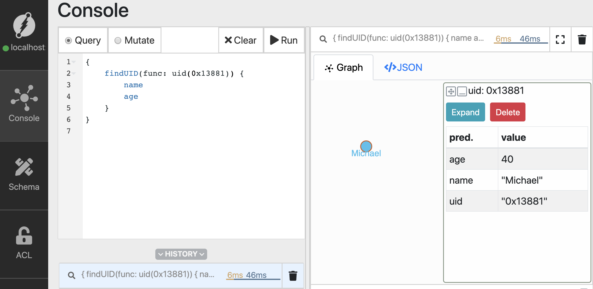

# UID's, updates, traversals and deletes 

Welcome to the second tutorial. 
I'm Karthic Rao, the Developer Advocate at Dgraph labs. 
Let's take off from where we left off in the last video. 
In the last video, we got started with Dgraph.
We learned about running Dgraph using docker-compose, adding data using mutations, and a couple of simple queries. 

Let's take forward the momentum.
Here's what we'll be learning in this tutorial,

- [Querying using uid's.](#Querying-using-uid's)
- [Updating predicates.](#updating-predicates) 
- [Traversing the edge.](#traversing-the-edge) 
- [Adding an edge between existing nodes.](#adding-an-edge-between-existing-nodes)
- [Using Recurse function for graph traversal](#using-recurse-function-for-graph-traversals)
- [Deleting a node](#deleting-a-node)

---

##Querying using uid's
In the last tutorial, we saw that Dgraph assigns a unique identifier `uid`, to the newly created nodes. 

Let's take a closer look at these uid's and use them to run queries. 


#### Running Dgraph 
Let's quickly get Dgraph up and running and insert some sample data. 

```sh
$ wget https://raw.githubusercontent.com/hackintoshrao/dgraph-tutorials/master/getting-started/1/docker-compose.yml

$ docker-compose up
```

In case you still have the data from the last lesson, let's delete them,

Go to Schema -> bulk edit - >Drop ALL 


---

#### Add sample data 
Let's get started! 

Let us build the following graph and do some interesting things around it, 


In this graph, Michael `follows` Pawan, who in turn `follows` Karthic. 

Go to Ratel, and run mutation to create the graph.

```sh
{
  "set":[
    {
      "name": "Michael",
      "age": 40,
      "follows": {
        "name": "Pawan",
        "age": 28,
        "follows":{
          "name": "Karthic",
          "age": 28
        }
      }
    }
  ]
}
```
 


Now we have the node, let's query for them and check out the graph we've built. 

Along with name and age, you could also add ask for `uid` in the list of predicates returned.

```sh
{
    findUID(func: has(name)) {
        uid 
        name 
        age 
    }
}
```

Click on nodes to expand them.


We have the Graph!

---
#### Using the uid() function

So far, we've only used Dgraph's `has` function in the queries. 

The inbuilt function `uid()` enables us to use the `uid` of nodes for queries and mutations.

Let's copy the UID of the node with `name` predicate set to `Michael`. 
We'll be using it to query for the node. 

In the query below, replace the uid `0x1388` with the `uid` you just copied. 

Let's run the query, 

```sh
{
    find_using_uid(func: uid(0x13881)){
        name 
        age
    }
}
```




---
##Updating predicates

Using the `uid` we could even update and delete a node.

Let's update the name of `Michael` to `Michael Compton`.  

Here's the mutation, let's go to the mutate tab and execute,  

```sh
{
  "set":[
    {
      "uid": "0x13881",
      "name": "Michael Compton"
    }
  ]
}
```

When a `uid` of a node is used in a `set` function, it updates predicates of an existing node. 

Let's test the update using a query, 

```sh
{
    find_using_uid(func: uid(0x13881)){
        name 
        age
    }
}
```


The update is successful.

---

##Traversing the edge
Edges connecting the nodes can be traversed in queries.
Traversals make use of the relationship between the nodes to explore the data.

Let's revisit the graph we've built, 
. 
Traversals help you answer questions like, 
- Whom does Michael follow? 
- Whom does Pawan follow? 

What's more interesting is that the traversals can be extended to multiple levels. 

A two-level traversal could answer questions like, `Give me all the followers of people whom Michael follow.` 

Deeper traversals help unearth complex relationships and patterns in the data.

---

#### One level traversals 
Let's find how to find the people who `Michael` follow using a level traversal query. 

```sh
{
    find_follower(func: uid(0x13881)){
        name 
        age
        follows {
          name 
          age 
        }
    }
}
```

Here's the result. 


Let's dissect the query,

- The `uid()` function is the criteria for selecting root-level nodes. 
- It's followed by the selecting predicates from selected root-level nodes.
- Using the name of an edge triggers traversals. 
  The edge connecting nodes are also called `uid predicates` in Dgraph.
- In this case, we traverse to all those nodes which are connected to the root level nodes via `follows` edge.
 These are level 1 nodes. 


In our simple graph, Michael follows only one person. 
Hence the traversal only returns one node.

---

#### Two-level traversals 
We could traverse further from level 1 nodes to level 2 nodes by extending the query. 
Let's try that next.

The first level of traversal returns people, followed by Michael. 
The next level of traversal further returns the people they follow. 


```sh
{
  find_follower(func: uid(0x13881)) {
    name 
    age 
    follows {
      name
      age
      follows {
        name 
        age
      }
    }
  }
}
```


---
## Adding an edge between existing nodes
Similarly, you can add an edge between already existing nodes. 

Let's say, `Karthic` started following `Michael`.
We could use the `uids` of both these nodes to create a `follows` edge between them. 
First, let's copy the `uids` from `Ratel.` 
The `uid` of `Karthic` is `0x13883`. 
We already have the uid of `Michael.` 

Let's execute the mutation, 

```sh
{
  "set":[
    {
      "uid": "0x13883",
      "follows": {
        "uid": "0x13881"
      }
    }
  ]
}

```


Now, with `Karthic` following `Michael,`  the new Graph should look like this, 

<Add an image>

Let's execute a level 3 query starting from `Michael` to traverse the cycle completely, 

---
##Using Recurse function for graph traversals
Remeber using the query for Level 2 traversal? Let's further expand it to traverse to another level, 


```sh
{
  find_follower(func: uid(0x13881)) {
    name 
    age 
    follows {
      name
      age
      follows {
        name 
        age
        follows {
          name 
          age
        }
      }
    }
  }
}
```


Though this works, it's not a great way to traverse the graph. 
The `Recurse()` directive is ideal for such use cases.

Recurse queries let you traverse a subset of the graph.
Either until we reach all leaf nodes or we reach the maximum depth which is specified by the depth parameter.

```sh
{
  find_follower(func: uid(0x13881))@recurse(depth: 4, loop:true) {
    name 
    age
    follows
  }
}
```


We achieve the same result, but with a much easier querying experience. 

[Check out the docs](https://docs.dgraph.io/query-language/#recurse-query) for detailed instructions on using the `recurse` directive.

---

##Deleting a node

Ratel makes it easier to compose `delete` mutations using the `uid's.` 

Just click on the node and click on the delete button. 
This auto-fills the mutation; let 's run it. 


---

## Wrapping up

We learned about CRUD operations and `recurse()` directive in this video. 
I hope you of all had found enjoyed the learning. 
Before we wrap up here's a sneak peek into our next tutorial. 

Go to the schema tab on the left, did we add any entry into the schema?


How about finding a predicate based on its value? 
Like, find a node with the name `Michael`?

Sounds interesting? Let's learn about schemas, string indexes, and advanced querying in Dgraph in our next tutorial.

Till then, happy Graphing!

---


